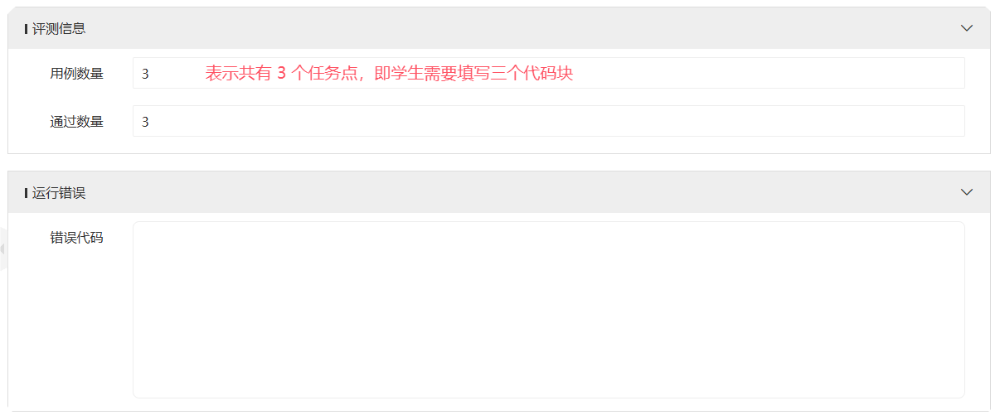

# AICourseTestScript

在错误代码字段里需要有以下两种错误信息：

1. 语法错误。即学生写的代码无法通过 Python 解释器。
2. 功能错误。即学生写的代码没有全部/合格完成题目要求的功能。

# 测评代码

分为 start.py、requirements.txt 以及每个任务点对应的测评文件。

### start.py

主测评文件，配置文件路径及具体的测评代码块索引，同时检查学生代码是否存在语法错误。使用时只需修改

① 学生代码文件路径。

② 每一个任务点（即 Notebook 中学生需要填写的每一个代码块）的测评文件路径，注意要与③需要测评的代码块索引相对应。

③ 每一个任务点的索引，即 Notebook 中学生需要填写的每一个代码块的索引。

④ 环境，若需要本地测试，则将该变量设置为本地 conda 环境名称，上传到 101 平台时需要将该变量设置为 None.

### requirements.txt

start.py 及每个任务点对应的测评文件所需的全部依赖。

### 每个任务点对应的测评文件

即 start.py 中②的文件，如下：

每一个文件都是针对一个任务点的具体测评逻辑，注意最后输出，若学生写的代码完成了题目要求的所有功能，则输出 1，否则输出 0，只允许输出这两个值。

# 效果

### 全部正确

### 语法错误

### 功能未完成

### 功能未完成且测评文件运行出错

